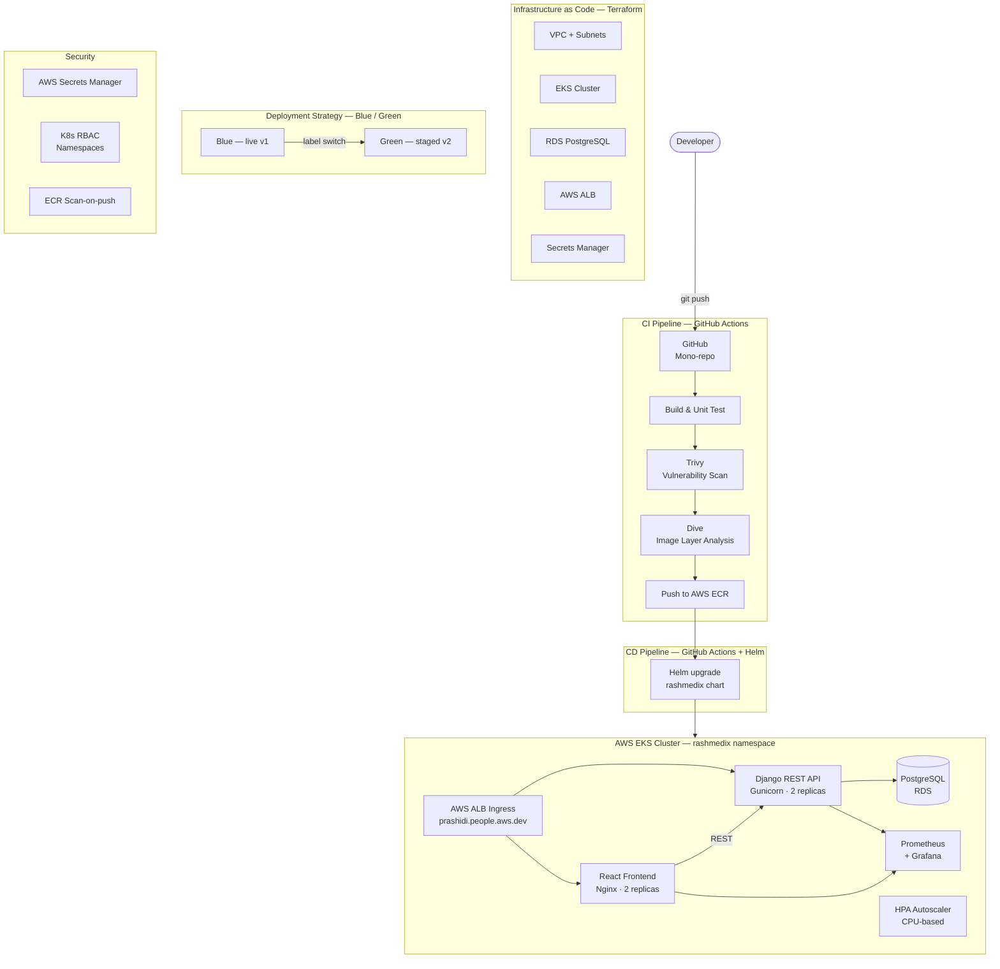

# RashMedix

Pharmacy stock management system — M.Sc. DevOps CA2  
**TU Dublin (Tallaght) · Enterprise Architecture Deployment · 2025/2026**  
Lecturer: Dr Omar Portillo

---

## Overview

RashMedix is a microservice-based pharmacy stock management application built and deployed as part of CA2. It demonstrates a fully automated enterprise CI/CD pipeline using the microservice architectural style, with at least two communicating services and an independent data layer.

---

## Architecture



---

## Tech Stack

| Layer | Technology | Module Reference |
|---|---|---|
| Frontend | React (Vite) + Nginx | Week 1 — Containers |
| Backend | Django REST Framework + Gunicorn | Week 1 — Containers |
| Database | PostgreSQL via Helm bitnami chart | Week 4 — Helm & Data Layer |
| Container Orchestration | AWS EKS (Kubernetes) | Week 3 — KaaS |
| Package Manager | Helm | Week 4 — Helm |
| IaC | Terraform | Week 11 — IaC |
| CI/CD | GitHub Actions | Weeks 3–5 |
| Deployment Strategy | Blue / Green | Week 5 — Release Orchestration |
| Monitoring | Prometheus + Grafana | Week 6 — Monitoring & Logging |
| Image Registry | AWS ECR (scan-on-push enabled) | Week 7 — Security |
| Ingress | AWS ALB (no raw public IPs) | Week 3 — KaaS |
| Secrets | AWS Secrets Manager | Week 7 — Security |
| RBAC | Kubernetes Namespaces | Week 7 — Security |

---

## Additional Features

The CA requires at least two tools/technologies not covered in the module labs.

| Feature | Tool | Justification |
|---|---|---|
| 1 | **Trivy** (Aqua Security) | Referenced in Week 7 lecture as open-source scanner — implemented in CI pipeline before image push |
| 2 | **Dive** | Listed in Lab00 install guide — used to analyse image layer efficiency and support sustainability goals |

---

## Repository Structure
rashmedix/
├── frontend/                  # React (Vite) application
│   ├── src/
│   │   ├── components/        # Navbar, StatCard, Badge, Layout
│   │   ├── pages/             # Dashboard, Medicines, Suppliers, Transactions, LowStock
│   │   └── services/api.js    # Axios API layer
│   ├── Dockerfile             # Multi-stage: build → nginx (linux/amd64)
│   └── nginx.conf             # Reverse proxy to backend-service
├── backend/                   # Django REST Framework API
│   ├── inventory/             # Models, serializers, views, URLs
│   ├── rashmedix_backend/     # Django settings, WSGI
│   ├── Dockerfile             # Python 3.12-slim (linux/amd64)
│   └── requirements.txt
├── infrastructure/
│   └── terraform/             # VPC, EKS, RDS, Secrets Manager, ALB
│       ├── main.tf
│       ├── variables.tf
│       ├── outputs.tf
│       └── versions.tf
├── k8s/
│   └── helm/
│       └── rashmedix/         # Helm chart
│           ├── Chart.yaml
│           ├── values.yaml
│           └── templates/
│               ├── backend-deployment.yaml
│               ├── frontend-deployment.yaml
│               ├── ingress.yaml
│               └── hpa.yaml
├── .github/
│   └── workflows/
│       ├── ci-frontend.yml    # Build · Trivy · Dive · Push
│       ├── ci-backend.yml     # Build · Trivy · Dive · Push
│       └── cd-deploy.yml      # Helm upgrade to EKS
├── docker-compose.yml         # Local full-stack development
└── README.md---

## Key Architecture Decisions

**Mono-repo vs poly-repo:** Mono-repo chosen for a two-service project. Each service has its own CI pipeline triggered by path filters (`frontend/**`, `backend/**`), preserving microservice independence while simplifying version management.

**Continuous Delivery vs Deployment:** Continuous Delivery with a manual approval gate before production. Appropriate for a pharmacy stock system where medication data requires human sign-off on releases.

**Blue/Green deployment:** Zero-downtime releases by running both versions simultaneously and switching the Kubernetes service selector label. Rollback is instant — revert the label switch.

**No raw public IPs:** Traffic enters via AWS ALB only. The subdomain `prashidi.people.aws.dev` resolves through Route 53 to the ALB, which routes internally to pods. Compliant with company AWS policy.

**PostgreSQL via RDS (not in-cluster):** Managed RDS provides automated backups (7-day retention), Multi-AZ failover capability, and storage encryption — all without operational overhead.

---

## Local Development
```bash
# Start full local stack
docker compose up --build

# Access
# Frontend: http://localhost
# Backend API: http://localhost:8000/api/
# Django admin: http://localhost:8000/admin/
```

---

## Deployment

```bash
# Provision infrastructure
cd infrastructure/terraform
terraform init && terraform apply

# Deploy application
cd k8s/helm
helm upgrade --install rashmedix ./rashmedix --namespace rashmedix
```

---

## Monitoring

Prometheus scrapes metrics from both services. Grafana dashboards display:
- Pod CPU and memory utilisation
- HTTP request rates and response times
- HPA scaling events
- RDS connection counts

---

## Security

- Trivy scans every image in CI before push
- ECR scan-on-push enabled for registry-level scanning
- Dive analyses image layers for unnecessary files
- Kubernetes RBAC with dedicated `rashmedix` namespace
- AWS Secrets Manager stores all credentials — no secrets in code or ConfigMaps
- TLS termination at ALB via AWS Certificate Manager

---

## Sustainability

- HPA scales pods down during low demand — no idle resource waste
- ECR lifecycle policy retains only last 5 tagged images
- Multi-stage Docker builds minimise image size
- Dive analysis identifies and removes unnecessary image layers
- Resource `requests` and `limits` set on all pods to prevent overprovisioning
- `t3.medium` nodes chosen as cost/performance balance for academic workload

---

## GenAI Usage

This project used Claude (Anthropic) at Level 3 (AI-Assisted Editing) as permitted by TU Dublin guidelines. See report appendix for full prompt history and description of student value-added beyond GenAI assistance.

---

## References

- Week 3 Lab — KaaS: Azure/AWS Kubernetes deployment
- Week 4 Lab — Helm & Data Layer: Bitnami chart installation
- Week 5 Lab — Release Orchestration: Blue/Green deployment manifests
- Week 6 Lecture — Monitoring and Logging: Prometheus/Grafana
- Week 7 Lecture — Security: Trivy (`docker run aquasec/trivy`), image scanning pipeline
- Week 10 Lecture — Sustainability: Resource limits, autoscaling, image efficiency
- Week 11 Lab — IaC Terraform: Infrastructure provisioning
- Lab00 — Installation Info: Dive (`wagoodman/dive`)
